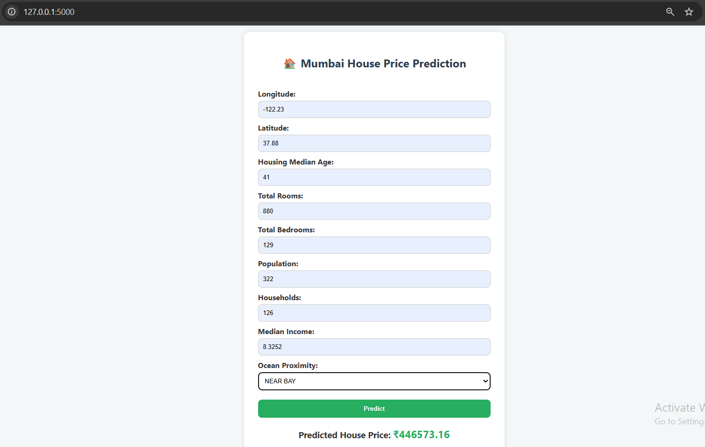

# 🏠 Housing Price Predictor

A machine learning project that predicts house prices based on various features like location, rooms, population, and median income. Built using Scikit-learn and use as a Flask web app.

---

## 📌 Features

- End-to-end ML pipeline with data preprocessing and model training
- Web interface for user input and live predictions
- Clean code structure and modular design
- Jupyter Notebook for data analysis and experimentation
- Ready-to-train with your own dataset

---

## 📁 Project Structure

housing-price-predictor/
│
├── app/
│ ├── main.py # Flask web app
│ ├── model.pkl # Trained model (not in GitHub)
│ ├── pipeline.pkl # Preprocessing pipeline (not in GitHub)
│ ├── static/
│ │ └── style.css # App styling
│ └── templates/
│ └── index.html # HTML form for user input
│
├── training/
│ ├── housing_data.xlsx # Dataset
│ └── train_model.py # Model training script
│
├── requirements.txt # Project dependencies
├── .gitignore # Files to ignore in Git
└── README.md # Project documentation

## 📓 Jupyter Notebook

You can view the full notebook [here](./notebook/house_price.ipynb).

⚙️ How to Run Locally
✅ Prerequisites
Python 3.8+

pip

📦 Install dependencies

pip install -r requirements.txt
🧠 Train the Model

cd training/
python train_model.py
This generates model.pkl and pipeline.pkl files in the app/ folder.

🚀 Start the Flask App

cd app/
python main.py
Open your browser and go to http://127.0.0.1:5000/

🧰 Tech Stack
Python

Pandas, NumPy

Scikit-learn

Flask (for deployment)

HTML/CSS (for UI)

VS Code

Jupyter Notebook

📂 Dataset
housing_data.xlsx: Contains features like total rooms, bedrooms, income, etc.

Preprocessed and scaled during training pipeline.

📌 Important Notes
The model.pkl and pipeline.pkl files are not included in the GitHub repo due to file size limits (>100MB).

You can re-train the model using the provided script or upload smaller dummy versions for demo purposes.

## ✍️ Author

**Akash**  
📫 [LinkedIn Profile](https://www.linkedin.com/in/akash-yadav-284909321/)  
📁 [My GitHub](https://github.com/Akash-8004)

